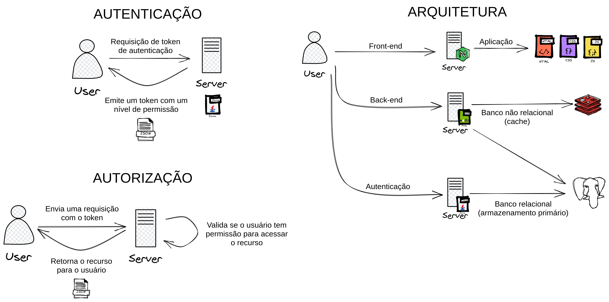

# APS - Reconhecimento biométrico

## Sobre

O projeto de atividades práticas supervisionadas foi desenvolvido para operar em um ambiente web, portanto, foram elaborados 3 serviços que operam em conjunto para funcionamento da aplicação. Sendo elas:

- Auth - Serviço de autenticação baseado em reconhecimento de imagens, construído em Java;
- API - Serviço que provê os dados, utilizando NodeJS;
- Web - Aplicação front-end que integra os serviços anteriores em uma interface gráfica na web.

## Arquitetura

No diagrama acima temos a arquitetura do projeto, onde 3 aplicações se comunicam entre si via endpoints HTTP REST para funcionamento do todo.

A arquitetura geral é dividida em 3 partes, sendo elas:

- Autenticação - Fluxo onde o usuário faz a requisição de uma chave de acesso para os recursos disponibilizados para a aplicação.
- Autorização - Fluxo onde o usuário envia o token emitido pelo servidor de autenticação para liberar seu acesso aos recursos.
- Arquitetura geral - Exemplificando o plano arquitetural do projeto e sua interação entre serviços.

## Autenticação
