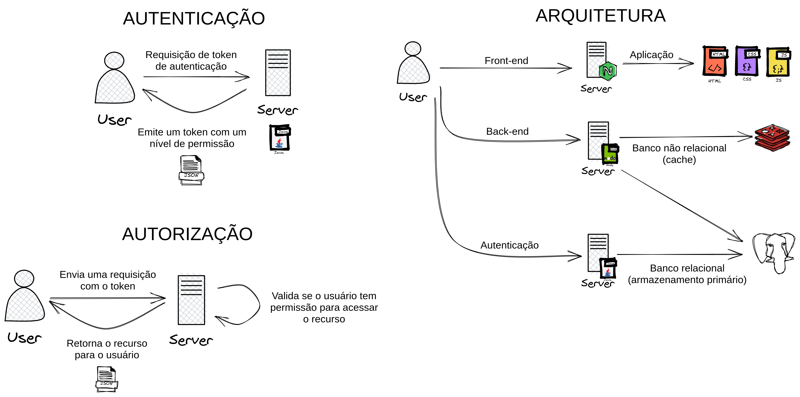

# APS - Reconhecimento biométrico

## Sobre

O projeto de atividades práticas supervisionadas foi desenvolvido para operar em um ambiente web, para isso foram elaborados 3 serviços que operam em conjunto para funcionamento da aplicação. Sendo elas:

- `auth` - Serviço de autenticação baseado em reconhecimento de imagens, construído em Java;
- `api` - Serviço que provê os dados, utilizando NodeJS;
- `web` - Aplicação front-end que integra os serviços anteriores em uma interface gráfica na web.

## Arquitetura



No diagrama acima temos a arquitetura do projeto, onde 3 aplicações se comunicam entre si via endpoints HTTP REST para funcionamento do todo.

A arquitetura geral é dividida em 3 partes, sendo elas:

- Autenticação - Fluxo onde o usuário faz a requisição de uma chave de acesso para os recursos disponibilizados para a aplicação.
- Autorização - Fluxo onde o usuário envia o token emitido pelo servidor de autenticação para liberar seu acesso aos recursos.
- Arquitetura geral - Exemplificando o plano arquitetural do projeto e sua interação entre serviços.

### Auth - Autenticação

O serviço de autenticação foi desenvolvido em Java utilizando o Spring Boot, onde o usuário faz a requisição para aquisição de um token de acesso a aplicação. Nela temos os módulos de autenticação e reconhecimento biométrico por imagem onde é validado se o usuário que deseja acessar o recurso é o mesmo que está cadastrado no sistema.

### API - Serviço de dados

A API foi desenvolvida em NodeJS utilizando o framework Express, onde o usuário envia o token de acesso para liberar seu acesso aos recursos. A aplicação disponibiliza os dados de algumas tabelas cadastradas no banco, como:

- Tarefas
- Usuários
- Faturas
- Incidentes

### Web - Aplicação web

A aplicação web é o front-end da aplicação, onde o usuário pode interagir com os recursos disponibilizados pela API. A aplicação foi desenvolvida utilizando o framework ReactJS, onde o usuário pode fazer o login e visualizar os dados disponibilizados pela API.

> **Obs:** Cada serviço tem um README mais detalhado descrevendo os módulos e suas funcionalidades.

## Executando o projeto

### Requisitos

- Java >= 11
- NodeJS >= 14
- NPM >= 5
- Docker (opcional)

### Executando os serviços

Os serviços deverão ser executados na ordem que estão listados abaixo:

### 1. Banco de dados

Para executar os serviços, é necessário que o banco de dados esteja no ar, o banco utilizado foi o PostgreSQL e na raiz do projeto pode-se encontrar um arquivo nomeado `docker-compose.yml`, ele descreve a arquitetura necessária para subir o projeto. Para subir uma instância do banco de dados, basta executar o comando:

```bash
docker-compose up -d # Pronto 🐋
```

### 2. API

Para executar o serviço de API, será necessário instalar as dependências do projeto utilizando o NPM, para isso, execute:

```sh
cd api      # Caso você não esteja dentro da pasta da API
npm install # Instala as dependências do projeto
```

Após a instalação das dependências, é necessário migrar as tabelas para o banco de dados, para fazer isso execute:

```sh
npm prisma db push # Migra a definição das tabelas para o banco de dados
```

Após a migração das tabelas, é necessário popular o banco de dados com alguns dados, para isso execute:

```sh
npm run seed # Adiciona os dados para o banco de dados
```

Com isso, alguns usuários estarão disponíveis para a autenticação, como por exemplo:

| nome            | email             |
| --------------- | ----------------- |
| Clayton Valdo   | clayton@mail.com  |
| Eder Lima       | eder@mail.com     |
| Gustavo Marinho | gustavo@mail.com  |
| Matheus Farali  | matheus@mail.com  |
| Marcus Vinicius | marcus@mail.com   |
| Jeferson        | jeferson@mail.com |

> **Obs:** A senha de cada usuário é sua foto na pasta `/uploads` do projeto.

Com esses passos feitos, o serviço de API está pronto para ser executado, para isso execute:

```sh
npm run dev # Executa o serviço de API
```

### 3. Auth

Para executar o serviço de Auth, será necessário instalar as dependências do projeto utilizando o Maven, para isso, execute:

```sh
cd auth                 # Caso você não esteja dentro da pasta da Auth
mvn install -DskipTests # Instala as dependências do projeto
```

Após instaladas as dependências, execute o projeto com o comando:

```sh
mvn clean compile exec:java # Executa o serviço de autenticação
```

### 4. Web

Para executar o serviço de Web, será necessário instalar as dependências do projeto utilizando o NPM, para isso, execute:

```sh
cd web      # Caso você não esteja dentro da pasta da Web
npm install # Instala as dependências do projeto
```

Com as dependências instaladas, execute o projeto com o comando:

```sh
npm run dev # Executa o serviço de web
```

### 5. Acessando a aplicação

Cada aplicação possui um endereço específico para ser acessada, são eles:

- auth - http://localhost:3210
- api - http://localhost:3333
- web - http://localhost:5173

## Autores

|  |  |  |  |  |
| ------------------------------------------------------ | ----------------------------------------------------------------- | ---------------------------------------------------------------- | ---------------------------------------------------------- | ------------------------------------------------------------------ |
| [Eder Lima](https://github.com/asynched)               | [Marcus Ribeiro ](https://github.com/marcusribeir0)               | [Matheus Farali](https://github.com/matheusfarali)               | [Jeferson Santos](https://github.com/worshx)               | [Gustavo Marinho](https://github.com/marinhogustavo)               |
